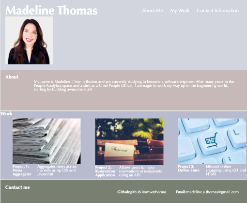

# <Professional Portfolio>

## Description

This project is a template for a professional portfolio. As I build out projects, I will add them to this page, allowing prospective employers to see what languages I can use and types of applications I can build.

## Installation

Open the "assets", "images", and index.html files in VS Code.

## Usage

This project is just bare bones right now so there is not much functionality. You can use the buttons at the top to navigate the page and know which project you are hovering over because the bachground changes.

 `

## Credits

No collaborators on this project
